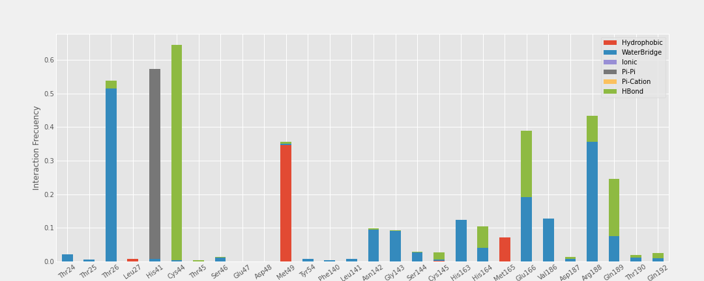

# Processing Interaction dat files from Maestro

### Post-process the output .dat file from Maestro (Schrodinger) after a molecular dynamics with Desmond. 

This jupiter notebook shows the steps to process the "raw data" or .dat files from Mestro after molecular dynamics. 
Specifically, consider the following files:

* PL-Contacts_HBond.dat
* PL-Contacts_Hydrophobic.dat
* PL-Contacts_Ionic.dat
* PL-Contacts_Pi-Cation.dat
* PL-Contacts_Pi-Pi.dat
* PL-Contacts_WaterBridge.dat 

## 1. Preparation
* 1 Create a folder with the necessary files. For example:

``` mkdir InteractionAnalysis```

``` mv PL-* InteractionAnalysis/```

## 2. Processing

Download in this folder "InteractionAnalysis" (previous step) the [*jupyter notebook file*](Processing_Interaction_datfiles_from_Maestro.ipynb). To run it you just need to open a console and type:

```jupyter-notebook ```

Open the jupiter notebook file and execute the steps.

The output will be an excel file (called Interaction.xlsx) which you can plot with another program (e.g. Excel, GraphPad, plotly, R, etc). 
You can apply more lines of code to this notebook to plot as you like!

Additionally, an image of the graphic will be saved in png format.

### This is the Interaction.xlsx file


## 3. Example of plots


### With Matplotlib 
<p align="center">
  
</p>

#### Other style

<p align="center">
  
</p>

### With GraphPad

<p align="center">
  
</p>


Note:
The interaction file *PL-Contacts_Metal* is not processed in this version.
